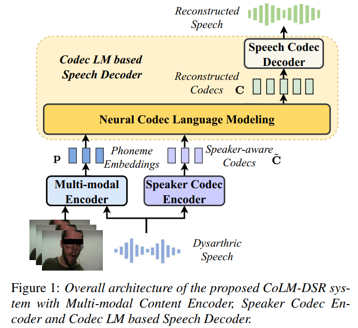

(Submitted on Interspeech 2024)

## 1. Abstract

Dysarthric speech reconstruction (DSR) aims to transform dysarthric speech into normal speech. It still suffers from low speaker similarity and poor prosody naturalness. In this paper, we propose a multi-modal DSR model by leveraging neural codec language modeling to improve the reconstruction results, especially for the speaker similarity and prosody naturalness. Our proposed model consists of: (i) a multi-modal content encoder to extract robust phoneme embeddings from dysarthric speech with auxiliary visual inputs; (ii) a speaker codec encoder to extract and normalize the speaker-aware codecs from the dysarthric speech, in order to provide original timbre and normal prosody; (iii) a codec language model based speech decoder to reconstruct the speech based on the extracted phoneme embeddings and normalized codecs. Evaluations on the commonly used UASpeech corpus show that our proposed model can achieve significant improvements in terms of speaker similarity and prosody naturalness.

## 2. Proposed Model Architecture

## 3. Comparison with Different Baseline Systems

- **AON-DSR**: It uses an audio-only encoder to extract phoneme embeddings, a prosody corrector to explicitly model the duration and pitch, a speaker encoder to represent the speaker
embedding, and a mel-decoder to reconstruct the melspectrogram based on the phoneme and prosody inputs.
- **VGG-DSR**: Following AON-DSR system, it uses a VGG-based audio-visual encoder instead of the audio-only encoder to extract phoneme embeddings.
- **AVHu-DSR**: Following AON-DSR system, it uses a AVHuBERT-based audio-visual encoder (similar to paper 2.1) instead of the audio-only encoder to extract phoneme embeddings.
- **CoLM-DSR**: Our proposed codec LM based multi-modal DSR system.

3.1.1 **Text**: <i>Enter</i>

| **Original Video**| <video controls style="width: 298px;"><source src="./data/F02/video/F02-enter.mp4" type="video/mp4"></video>| **Original Speech** |<audio controls><source src="./data/F02/original/F02-enter.wav" type="audio/wav"></audio>|
|:---------------------------------------:|:--------------------------------------:|:---------------------------------------:|:--------------------------------------:|
| **AON-DSR** | <audio controls><source src="./data/F02/a/F02-enter.wav" type="audio/wav"></audio> | **VGG-DSR** | <audio controls><source src="./data/F02/av/F02-enter.wav" type="audio/wav"></audio> |
| **AVHu-DSR** | <audio controls><source src="./data/F02/avhubert/F02-enter.wav" type="audio/wav"></audio> | **CoLM-DSR** | <audio controls><source src="./data/F02/codecLM/F02-enter.wav" type="audio/wav"></audio> |

3.1.2 **Text**: <i>Shift</i>

| **Original Video**| <video controls style="width: 298px;"><source src="./data/F02/video/F02-shift.mp4" type="video/mp4"></video>| **Original Speech** |<audio controls><source src="./data/F02/original/F02-shift.wav" type="audio/wav"></audio>|
|:---------------------------------------:|:--------------------------------------:|:---------------------------------------:|:--------------------------------------:|
| **AON-DSR** | <audio controls><source src="./data/F02/a/F02-shift.wav" type="audio/wav"></audio> | **VGG-DSR** | <audio controls><source src="./data/F02/av/F02-shift.wav" type="audio/wav"></audio> |
| **AVHu-DSR** | <audio controls><source src="./data/F02/avhubert/F02-shift.wav" type="audio/wav"></audio> | **CoLM-DSR** | <audio controls><source src="./data/F02/codecLM/F02-shift.wav" type="audio/wav"></audio> |

3.1.3 **Text**: <i>Paragraph</i>

| **Original Video**| <video controls style="width: 298px;"><source src="./data/F02/video/F02-paragraph.mp4" type="video/mp4"></video>| **Original Speech** |<audio controls><source src="./data/F02/original/F02-paragraph.wav" type="audio/wav"></audio>|
|:---------------------------------------:|:--------------------------------------:|:---------------------------------------:|:--------------------------------------:|
| **AON-DSR** | <audio controls><source src="./data/F02/a/F02-paragraph.wav" type="audio/wav"></audio> | **VGG-DSR** | <audio controls><source src="./data/F02/av/F02-paragraph.wav" type="audio/wav"></audio> |
| **AVHu-DSR** | <audio controls><source src="./data/F02/avhubert/F02-paragraph.wav" type="audio/wav"></audio> | **CoLM-DSR** | <audio controls><source src="./data/F02/codecLM/F02-paragraph.wav" type="audio/wav"></audio> |

3.1.4 **Text**: <i>Word</i>

| **Original Video**| <video controls style="width: 298px;"><source src="./data/F02/video/F02-word.mp4" type="video/mp4"></video>| **Original Speech** |<audio controls><source src="./data/F02/original/F02-word.wav" type="audio/wav"></audio>|
|:---------------------------------------:|:--------------------------------------:|:---------------------------------------:|:--------------------------------------:|
| **AON-DSR** | <audio controls><source src="./data/F02/a/F02-word.wav" type="audio/wav"></audio> | **VGG-DSR** | <audio controls><source src="./data/F02/av/F02-word.wav" type="audio/wav"></audio> |
| **AVHu-DSR** | <audio controls><source src="./data/F02/avhubert/F02-word.wav" type="audio/wav"></audio> | **CoLM-DSR** | <audio controls><source src="./data/F02/codecLM/F02-word.wav" type="audio/wav"></audio> |

3.1.5 **Text**: <i>When</i>

| **Original Video**| <video controls style="width: 298px;"><source src="./data/F02/video/F02-when.mp4" type="video/mp4"></video>| **Original Speech** |<audio controls><source src="./data/F02/original/F02-when.wav" type="audio/wav"></audio>|
|:---------------------------------------:|:--------------------------------------:|:---------------------------------------:|:--------------------------------------:|
| **AON-DSR** | <audio controls><source src="./data/F02/a/F02-when.wav" type="audio/wav"></audio> | **VGG-DSR** | <audio controls><source src="./data/F02/av/F02-when.wav" type="audio/wav"></audio> |
| **AVHu-DSR** | <audio controls><source src="./data/F02/avhubert/F02-when.wav" type="audio/wav"></audio> | **CoLM-DSR** | <audio controls><source src="./data/F02/codecLM/F02-when.wav" type="audio/wav"></audio> |

3.1.6 **Text**: <i>One</i>

| **Original Video**| <video controls style="width: 298px;"><source src="./data/F02/video/F02-one.mp4" type="video/mp4"></video>| **Original Speech** |<audio controls><source src="./data/F02/original/F02-one.wav" type="audio/wav"></audio>|
|:---------------------------------------:|:--------------------------------------:|:---------------------------------------:|:--------------------------------------:|
| **AON-DSR** | <audio controls><source src="./data/F02/a/F02-one.wav" type="audio/wav"></audio> | **VGG-DSR** | <audio controls><source src="./data/F02/av/F02-one.wav" type="audio/wav"></audio> |
| **AVHu-DSR** | <audio controls><source src="./data/F02/avhubert/F02-one.wav" type="audio/wav"></audio> | **CoLM-DSR** | <audio controls><source src="./data/F02/codecLM/F02-one.wav" type="audio/wav"></audio> |

3.1.7 **Text**: <i>Seven</i>

| **Original Video**| <video controls style="width: 298px;"><source src="./data/F02/video/F02-seven.mp4" type="video/mp4"></video>| **Original Speech** |<audio controls><source src="./data/F02/original/F02-seven.wav" type="audio/wav"></audio>|
|:---------------------------------------:|:--------------------------------------:|:---------------------------------------:|:--------------------------------------:|
| **AON-DSR** | <audio controls><source src="./data/F02/a/F02-seven.wav" type="audio/wav"></audio> | **VGG-DSR** | <audio controls><source src="./data/F02/av/F02-seven.wav" type="audio/wav"></audio> |
| **AVHu-DSR** | <audio controls><source src="./data/F02/avhubert/F02-seven.wav" type="audio/wav"></audio> | **CoLM-DSR** | <audio controls><source src="./data/F02/codecLM/F02-seven.wav" type="audio/wav"></audio> |

3.2.1 **Text**: <i>Line</i>

| **Original Video**| <video controls style="width: 298px;"><source src="./data/M16/video/M16-line.mp4" type="video/mp4"></video>| **Original Speech** |<audio controls><source src="./data/M16/original/M16-line.wav" type="audio/wav"></audio>|
|:---------------------------------------:|:--------------------------------------:|:---------------------------------------:|:--------------------------------------:|
| **AON-DSR** | <audio controls><source src="./data/M16/a/M16-line.wav" type="audio/wav"></audio> | **VGG-DSR** | <audio controls><source src="./data/M16/av/M16-line.wav" type="audio/wav"></audio> |
| **AVHu-DSR** | <audio controls><source src="./data/M16/avhubert/M16-line.wav" type="audio/wav"></audio> | **CoLM-DSR** | <audio controls><source src="./data/M16/codecLM/M16-line.wav" type="audio/wav"></audio> |

3.2.2 **Text**: <i>Copy</i>

| **Original Video**| <video controls style="width: 298px;"><source src="./data/M16/video/M16-copy.mp4" type="video/mp4"></video>| **Original Speech** |<audio controls><source src="./data/M16/original/M16-copy.wav" type="audio/wav"></audio>|
|:---------------------------------------:|:--------------------------------------:|:---------------------------------------:|:--------------------------------------:|
| **AON-DSR** | <audio controls><source src="./data/M16/a/M16-copy.wav" type="audio/wav"></audio> | **VGG-DSR** | <audio controls><source src="./data/M16/av/M16-copy.wav" type="audio/wav"></audio> |
| **AVHu-DSR** | <audio controls><source src="./data/M16/avhubert/M16-copy.wav" type="audio/wav"></audio> | **CoLM-DSR** | <audio controls><source src="./data/M16/codecLM/M16-copy.wav" type="audio/wav"></audio> |

3.2.3 **Text**: <i>Downward</i>

| **Original Video**| <video controls style="width: 298px;"><source src="./data/M16/video/M16-downward.mp4" type="video/mp4"></video>| **Original Speech** |<audio controls><source src="./data/M16/original/M16-downward.wav" type="audio/wav"></audio>|
|:---------------------------------------:|:--------------------------------------:|:---------------------------------------:|:--------------------------------------:|
| **AON-DSR** | <audio controls><source src="./data/M16/a/M16-downward.wav" type="audio/wav"></audio> | **VGG-DSR** | <audio controls><source src="./data/M16/av/M16-downward.wav" type="audio/wav"></audio> |
| **AVHu-DSR** | <audio controls><source src="./data/M16/avhubert/M16-downward.wav" type="audio/wav"></audio> | **CoLM-DSR** | <audio controls><source src="./data/M16/codecLM/M16-downward.wav" type="audio/wav"></audio> |

3.2.4 **Text**: <i>Bravo</i>

| **Original Video**| <video controls style="width: 298px;"><source src="./data/M16/video/M16-bravo.mp4" type="video/mp4"></video>| **Original Speech** |<audio controls><source src="./data/M16/original/M16-bravo.wav" type="audio/wav"></audio>|
|:---------------------------------------:|:--------------------------------------:|:---------------------------------------:|:--------------------------------------:|
| **AON-DSR** | <audio controls><source src="./data/M16/a/M16-bravo.wav" type="audio/wav"></audio> | **VGG-DSR** | <audio controls><source src="./data/M16/av/M16-bravo.wav" type="audio/wav"></audio> |
| **AVHu-DSR** | <audio controls><source src="./data/M16/avhubert/M16-bravo.wav" type="audio/wav"></audio> | **CoLM-DSR** | <audio controls><source src="./data/M16/codecLM/M16-bravo.wav" type="audio/wav"></audio> |

3.2.5 **Text**: <i>Kilo</i>

| **Original Video**| <video controls style="width: 298px;"><source src="./data/M16/video/M16-kilo.mp4" type="video/mp4"></video>| **Original Speech** |<audio controls><source src="./data/M16/original/M16-kilo.wav" type="audio/wav"></audio>|
|:---------------------------------------:|:--------------------------------------:|:---------------------------------------:|:--------------------------------------:|
| **AON-DSR** | <audio controls><source src="./data/M16/a/M16-kilo.wav" type="audio/wav"></audio> | **VGG-DSR** | <audio controls><source src="./data/M16/av/M16-kilo.wav" type="audio/wav"></audio> |
| **AVHu-DSR** | <audio controls><source src="./data/M16/avhubert/M16-kilo.wav" type="audio/wav"></audio> | **CoLM-DSR** | <audio controls><source src="./data/M16/codecLM/M16-kilo.wav" type="audio/wav"></audio> |

3.2.6 **Text**: <i>Tango</i>

| **Original Video**| <video controls style="width: 298px;"><source src="./data/M16/video/M16-tango.mp4" type="video/mp4"></video>| **Original Speech** |<audio controls><source src="./data/M16/original/M16-tango.wav" type="audio/wav"></audio>|
|:---------------------------------------:|:--------------------------------------:|:---------------------------------------:|:--------------------------------------:|
| **AON-DSR** | <audio controls><source src="./data/M16/a/M16-tango.wav" type="audio/wav"></audio> | **VGG-DSR** | <audio controls><source src="./data/M16/av/M16-tango.wav" type="audio/wav"></audio> |
| **AVHu-DSR** | <audio controls><source src="./data/M16/avhubert/M16-tango.wav" type="audio/wav"></audio> | **CoLM-DSR** | <audio controls><source src="./data/M16/codecLM/M16-tango.wav" type="audio/wav"></audio> |

## 4. Investigation on Dysarthric Codecs and Normal Codecs

- **Dysarthric**: We use the dysarthric codecs directly to generate the reconstructed speech.
- **Normal**: We use the converted normal codecs to generate the reconstructed speech.

4.1 **Text**: <i>Although</i>

| **Original Video**| <video controls style="width: 298px;"><source src="./data/F04/video/F04-although.mp4" type="video/mp4"></video>| **Original Speech** |<audio controls><source src="./data/F04/original/F04-although.wav" type="audio/wav"></audio>|
|:---------------------------------------:|:--------------------------------------:|:---------------------------------------:|:--------------------------------------:|
| **Dysarthric** | <audio controls><source src="./data/F04/dysarthric_F04/F04-although.wav" type="audio/wav"></audio> | **Normal** | <audio controls><source src="./data/F04/normal_F04/F04-although.wav" type="audio/wav"></audio> |

4.2 **Text**: <i>Bulrush</i>

| **Original Video**| <video controls style="width: 298px;"><source src="./data/F04/video/F04-bulrush.mp4" type="video/mp4"></video>| **Original Speech** |<audio controls><source src="./data/F04/original/F04-bulrush.wav" type="audio/wav"></audio>|
|:---------------------------------------:|:--------------------------------------:|:---------------------------------------:|:--------------------------------------:|
| **Dysarthric** | <audio controls><source src="./data/F04/dysarthric_F04/F04-bulrush.wav" type="audio/wav"></audio> | **Normal** | <audio controls><source src="./data/F04/normal_F04/F04-bulrush.wav" type="audio/wav"></audio> |

4.3 **Text**: <i>Left</i>

| **Original Video**| <video controls style="width: 298px;"><source src="./data/F04/video/F04-left.mp4" type="video/mp4"></video>| **Original Speech** |<audio controls><source src="./data/F04/original/F04-left.wav" type="audio/wav"></audio>|
|:---------------------------------------:|:--------------------------------------:|:---------------------------------------:|:--------------------------------------:|
| **Dysarthric** | <audio controls><source src="./data/F04/dysarthric_F04/F04-left.wav" type="audio/wav"></audio> | **Normal** | <audio controls><source src="./data/F04/normal_F04/F04-left.wav" type="audio/wav"></audio> |

4.4 **Text**: <i>People</i>

| **Original Video**| <video controls style="width: 298px;"><source src="./data/F04/video/F04-people.mp4" type="video/mp4"></video>| **Original Speech** |<audio controls><source src="./data/F04/original/F04-people.wav" type="audio/wav"></audio>|
|:---------------------------------------:|:--------------------------------------:|:---------------------------------------:|:--------------------------------------:|
| **Dysarthric** | <audio controls><source src="./data/F04/dysarthric_F04/F04-people.wav" type="audio/wav"></audio> | **Normal** | <audio controls><source src="./data/F04/normal_F04/F04-people.wav" type="audio/wav"></audio> |

4.5 **Text**: <i>Lima</i>

| **Original Video**| <video controls style="width: 298px;"><source src="./data/F04/video/F04-lima.mp4" type="video/mp4"></video>| **Original Speech** |<audio controls><source src="./data/F04/original/F04-lima.wav" type="audio/wav"></audio>|
|:---------------------------------------:|:--------------------------------------:|:---------------------------------------:|:--------------------------------------:|
| **Dysarthric** | <audio controls><source src="./data/F04/dysarthric_F04/F04-lima.wav" type="audio/wav"></audio> | **Normal** | <audio controls><source src="./data/F04/normal_F04/F04-lima.wav" type="audio/wav"></audio> |

4.6 **Text**: <i>Quebec</i>

| **Original Video**| <video controls style="width: 298px;"><source src="./data/F04/video/F04-quebec.mp4" type="video/mp4"></video>| **Original Speech** |<audio controls><source src="./data/F04/original/F04-quebec.wav" type="audio/wav"></audio>|
|:---------------------------------------:|:--------------------------------------:|:---------------------------------------:|:--------------------------------------:|
| **Dysarthric** | <audio controls><source src="./data/F04/dysarthric_F04/F04-quebec.wav" type="audio/wav"></audio> | **Normal** | <audio controls><source src="./data/F04/normal_F04/F04-quebec.wav" type="audio/wav"></audio> |

    
    

   
